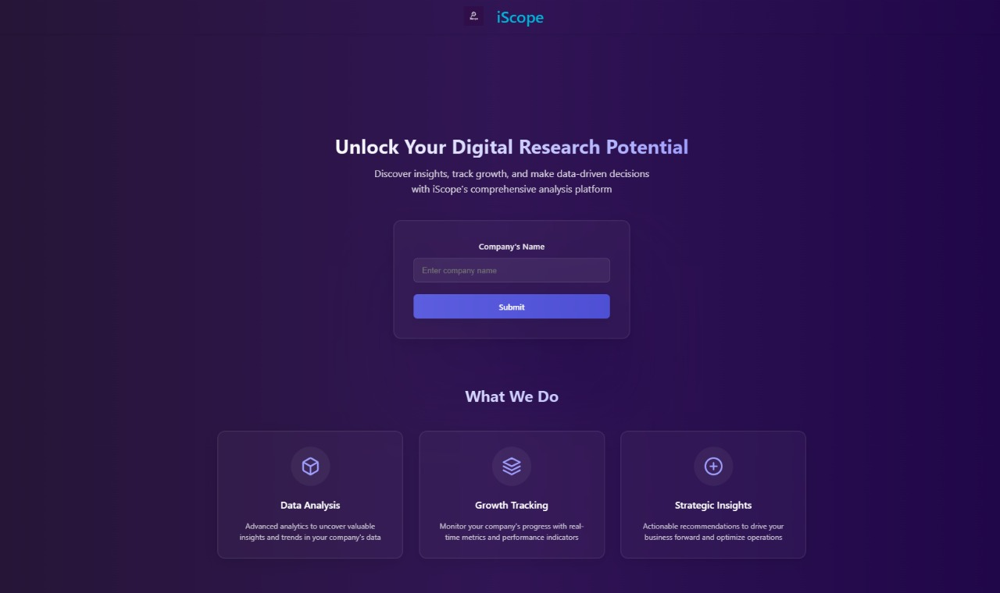
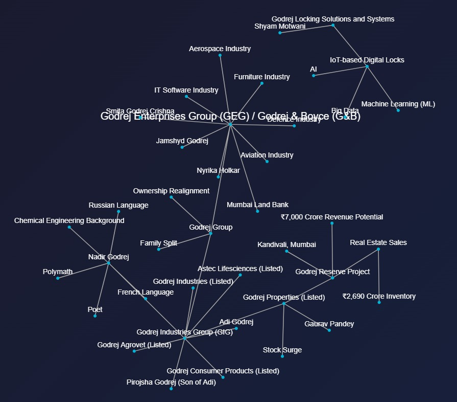
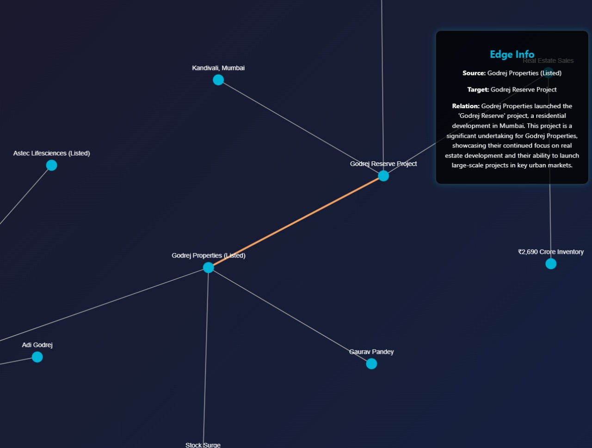

# Financial News Analysis and Relationship Graph Generator

A powerful tool that analyzes news articles about companies and generates interactive relationship graphs showing key entities and their connections.

## 🌟 Features

- **Automated News Scraping**: Gathers relevant articles from major financial and business news sources
- **Entity Relationship Extraction**: Uses advanced AI to identify and connect key entities from news articles
- **Interactive Graph Visualization**: Presents relationships in an intuitive, interactive graph format
- **Real-time Analysis**: Processes and analyzes news articles in real-time

## 🛠️ Tech Stack

### Backend
- Python 3.x
- Flask (Web Framework)
- LangChain (LLM Integration)
- Google Generative AI
- BeautifulSoup4 (Web Scraping)

### Frontend
- React.js
- D3.js (Configuring Graph Forces)
- force-graph-2D (Graph Visualization)

## 🚀 Getting Started

### Prerequisites

- Python 3.x
- Node.js and npm
- Google API Key (for Gemini AI and Custom Google Search)

### Installation

1. **Clone the repository**
   ```bash
   git clone https://github.com/meghrajwagh/nullptr.git
   cd nullptr
   ```

2. **Set up the backend**
   ```bash
   cd backend
   pip install -r requirements.txt
   ```

3. **Set up the frontend**
   ```bash
   cd ../frontend
   npm install
   ```

4. **Configure environment variables**
   Create a `.env` file in the backend directory with:
   ```
   GOOGLE_API_KEY=your_api_key_here
   GOOGLE_CSE_ID=your_cse_id
   ```

### Running the Application

1. **Start the backend server**
   ```bash
   cd backend
   python api.py
   ```

2. **Start the frontend development server**
   ```bash
   cd frontend
   npm run dev
   ```

3. **Access the application**
   Open your browser and navigate to `http://localhost:5173`

## 📊 How It Works

1. **Input**: Enter a company name in the search box
2. **Data Collection**: The system scrapes relevant news articles from multiple sources
3. **Analysis**: The AI model processes the articles to extract entities and relationships
4. **Visualization**: Results are displayed as an interactive graph showing:
   - Key entities (companies, people, events)
   - Relationships between entities
   - Detailed descriptions of connections

## 🔍 Supported News Sources

- NDTV
- The Hindu
- BBC
- Bloomberg
- Financial Times
- CNBC

## Visuals

### Homepage

### Mindmap

### Connection
